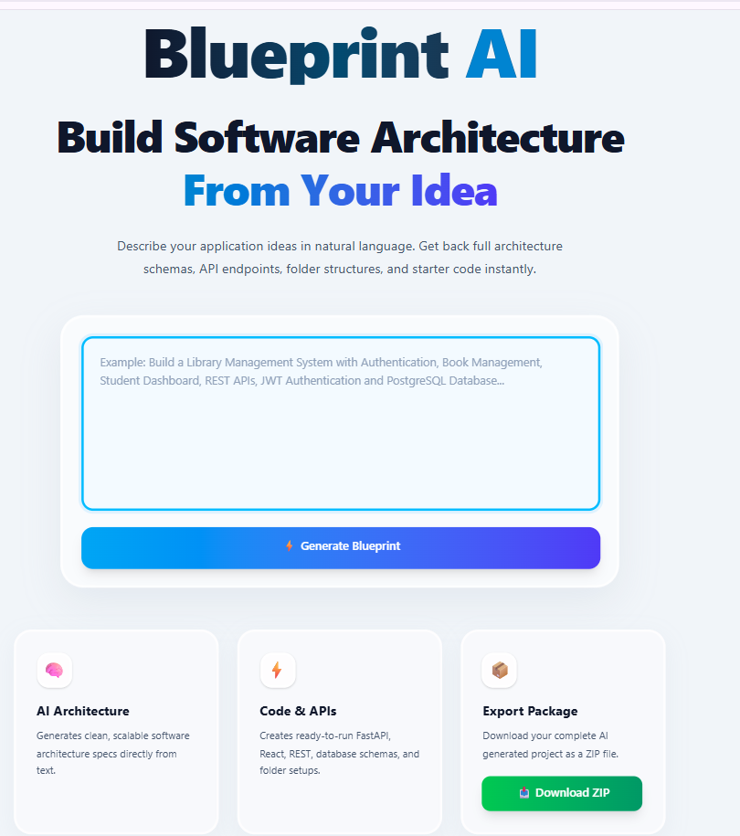
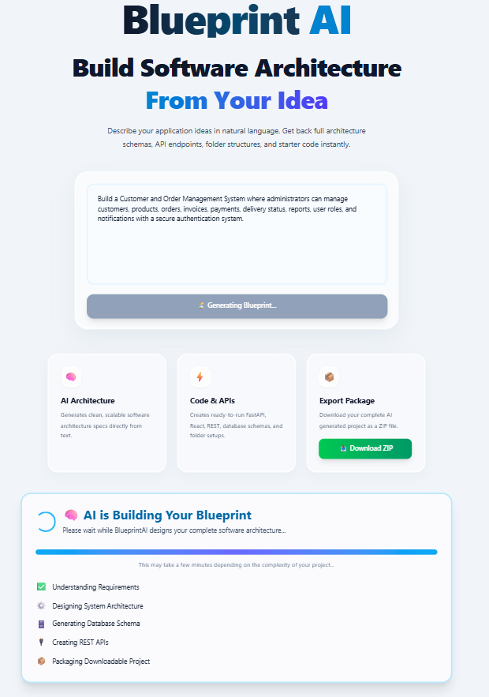
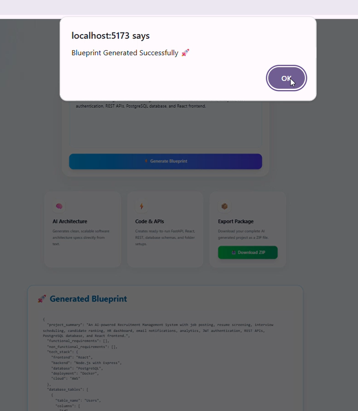

# 🚀 BlueprintAI

> **AI-Powered Software Requirement to Complete Project Blueprint Generator**

BlueprintAI converts a plain-English software idea into a structured starter project by automatically generating:

- 📋 Project Summary
- ⚙️ Functional & Non-Functional Requirements
- 🏗️ Software Architecture
- 🗄️ Database Schema
- 🔗 REST API Endpoints
- 📁 Folder Structure
- 📄 File Structure
- 💻 AI-Generated Starter Code
- 📦 Downloadable ZIP Project

---

# ✨ Features

- 🤖 AI-powered blueprint generation
- 📂 Automatic folder & file structure creation
- 🗄️ Database schema generation
- 🔗 REST API generation
- 💻 Starter backend/frontend code generation
- 📦 One-click ZIP download
- ⚡ FastAPI backend
- 🎨 React frontend
- 🧠 Powered by Ollama + Qwen 2.5

---

# 🛠️ Tech Stack

| Technology | Purpose |
|------------|---------|
| Python | Backend |
| FastAPI | REST API |
| React | Frontend |
| Ollama | Local LLM Runtime |
| Qwen 2.5 | AI Model |
| PostgreSQL | Database Design |
| Docker | Deployment Blueprint |

---

# 📸 Project Demo

## 🏠 Home Page



---

## 🤖 AI Generating Blueprint



---

## ✅ Blueprint Generated Successfully



---

## 📋 Generated Blueprint


---

## 📦 Download Generated ZIP


---

## 📁 Extracted Project


---

## 💻 AI Generated Code


---

# ⚙️ Installation

```bash
git clone https://github.com/tanvibhardwaj2024-del/BlueprintAI.git

cd BlueprintAI

pip install -r requirements.txt

uvicorn main:app --reload
```

Frontend

```bash
cd frontend

npm install

npm run dev
```

---

# 🚀 How It Works

```
User Requirement
        │
        ▼
React Frontend
        │
        ▼
FastAPI Backend
        │
        ▼
Ollama + Qwen 2.5
        │
        ▼
Blueprint Generation
        │
        ▼
Folder Structure
        │
        ▼
Database Schema
        │
        ▼
REST APIs
        │
        ▼
Starter Code
        │
        ▼
ZIP Export
```

---

# 📂 Project Structure

```
BlueprintAI
│
├── app
│   ├── prompts
│   ├── schemas
│   └── services
│
├── frontend
│
├── assets
│
├── main.py
│
└── requirements.txt
```

---

# 🔮 Future Improvements

- Cloud deployment
- Multi-model AI support
- Authentication
- Microservice generation
- CI/CD pipeline generation
- Kubernetes deployment templates

---

# 👩‍💻 Author

**Tanvi Bhardwaj**

⭐ If you like this project, don't forget to star the repository!
